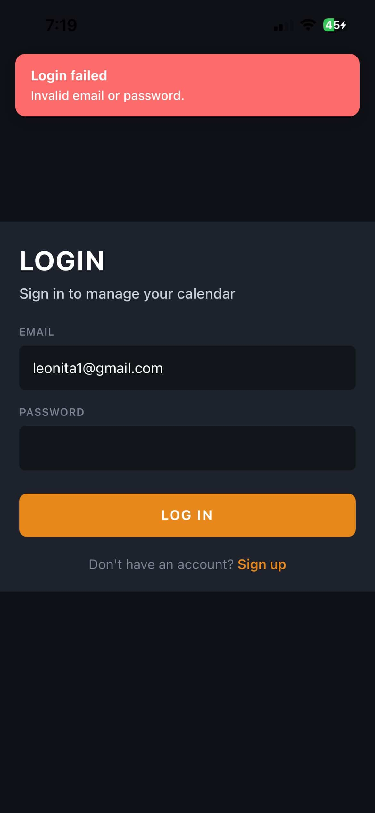
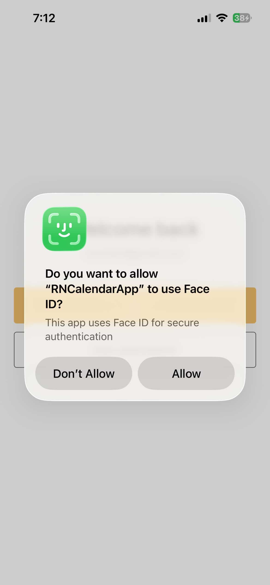
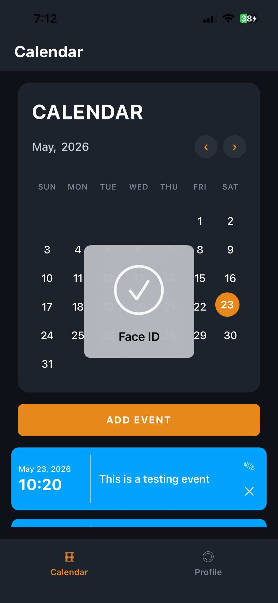
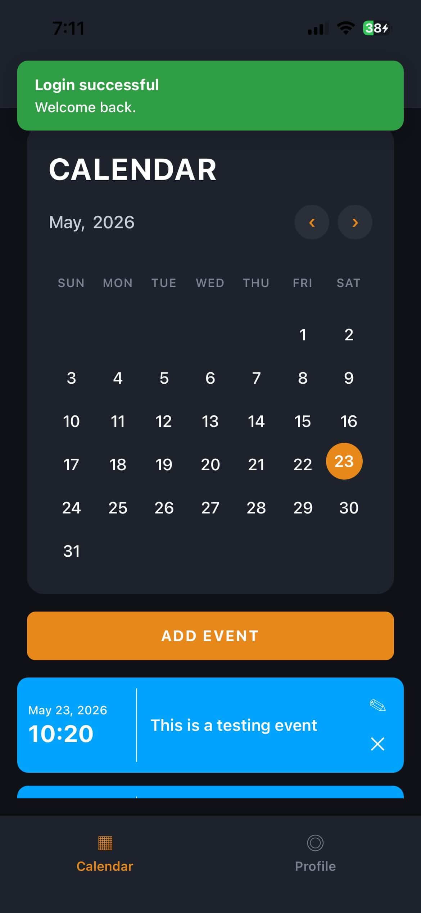
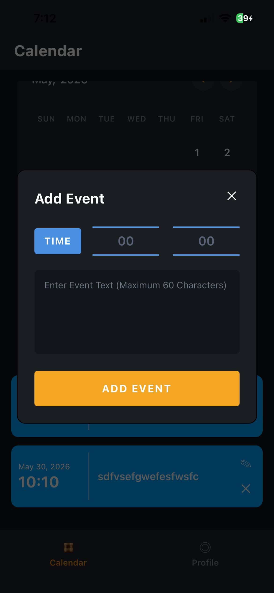
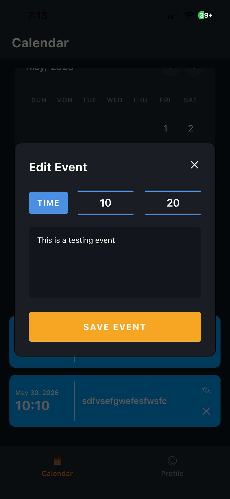

# RNCalendarApp

A React Native calendar app with Firebase authentication and Firestore event storage.

## Screenshots

### Authentication

**Login**



**Face ID permission (iOS)**



**Biometric unlock on return**



### Calendar

**Home screen after login**



**Add event**



**Edit event**



## Prerequisites

Before running the app, set up your development environment using the [React Native environment setup guide](https://reactnative.dev/docs/set-up-your-environment).

You will need:

- **Node.js** >= 22.11.0
- **npm** (or Yarn)
- **Xcode** and **CocoaPods** (for iOS, macOS only)
- **Android Studio** and an Android SDK (for Android)

Firebase config files are already included in the repo:

- `android/app/google-services.json`
- `ios/GoogleService-Info.plist`

## Install dependencies

From the project root:

```sh
npm install
```

## iOS setup (first time or after native dependency changes)

Install CocoaPods via Bundler:

```sh
bundle install
```

Install iOS pods:

```sh
cd ios && bundle exec pod install && cd ..
```

## Run the app

### Option 1: One command (recommended)

**iOS Simulator**

```sh
npm run ios
```

**Android Emulator**

```sh
npm run android
```

These commands start Metro and build/launch the app on the default simulator or emulator.

### Option 2: Separate Metro and native build

**Terminal 1 — start Metro**

```sh
npm start
```

**Terminal 2 — run the app**

```sh
npm run ios
# or
npm run android
```

You can also open `ios/RNCalendarApp.xcworkspace` in Xcode or the `android` folder in Android Studio and run from there.

## Using the app

### 1. Create an account

When the app launches, you will see the login screen.

1. Tap **Sign up** to open the signup screen.
2. Enter your email and a password (minimum 8 characters).
3. Tap **SIGN UP**.

After your account is created, you are signed in automatically and taken to the home screen.

If you already have an account, tap **Log in** on the signup screen and sign in with your email and password.

### 2. Create an event

Once you are signed in, you can add calendar events from the home screen:

1. Tap a date on the calendar, **or** tap the **ADD EVENT** button.
2. Enter the event time and details in the modal.
3. Save the event — it will appear in your event list and is stored in Firestore for your account.

You can also edit or delete events from the event list.

## Other scripts

```sh
npm test      # Run unit tests
npm run lint  # Run ESLint
```

## Troubleshooting

- **Metro cache issues:** `npm start -- --reset-cache`
- **iOS build failures after dependency updates:** run `bundle exec pod install` again inside `ios/`
- **Android build failures:** try `cd android && ./gradlew clean && cd ..`
- See the [React Native troubleshooting guide](https://reactnative.dev/docs/troubleshooting) for more help
